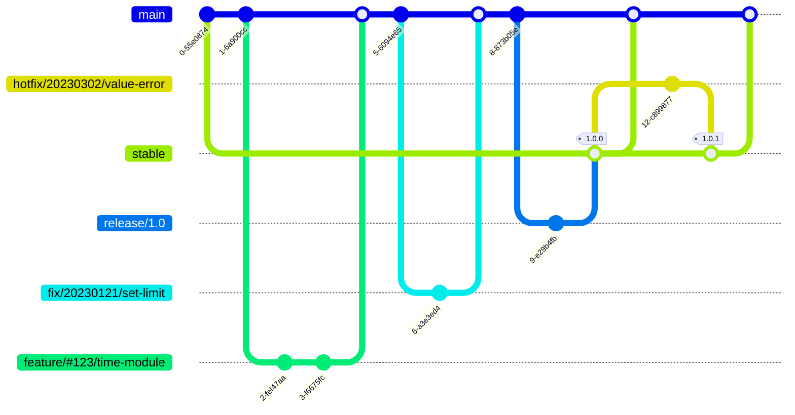

# Contributing

Thank you for your interest in contributing to PAMIQ Core. This guide explains how to set up your development environment.

## 📋 Prerequisites

Please install the following tools in advance:

### Required Tools

- 🐳 **Docker (Docker Compose)**

  - Docker Desktop: <https://www.docker.com/get-started/>
  - Docker Engine (Linux only): <https://docs.docker.com/engine/install/>
  - Verification command:
    ```sh
    docker version && docker compose version
    ```

- 🔨 **make**

  - Windows: Install via [`scoop`](https://scoop.sh) or [`chocolatey`](https://chocolatey.org)
  - macOS: Pre-installed
  - Linux: Use your distribution's package manager (e.g., for Ubuntu: `sudo apt install make`)
  - Verification command:
    ```sh
    make -v
    ```

- 🌲 **git**

  - Download: <https://git-scm.com/downloads>
  - Verification command:
    ```sh
    git -v
    ```

## 🚀 Setting Up the Development Environment

1. Repository Setup

   First, fork the repository by clicking the "Fork" button:

   [](https://github.com/MLShukai/pamiq-core/fork)

   After fork, clone your repository:

   ```sh
   git clone https://github.com/your-name/pamiq-core.git
   cd pamiq-core
   ```

2. Building the Docker Environment

   ```sh
   # Build the image
   make docker-build

   # Start the container
   make docker-up

   # Connect to the container
   make docker-attach
   ```

3. Git Initial Configuration

   ```sh
   git config user.name <your GitHub username>
   git config user.email <your GitHub email>
   ```

## 💻 Development Environment Configuration

### Development with VSCode

You can develop by attaching to the container from your preferred editor (VSCode recommended).

📚 Reference: [Attach with VSCode Dev Containers extension](https://code.visualstudio.com/docs/devcontainers/attach-container)

The development container includes the following environment:

- Package manager ([**uv**](https://docs.astral.sh/uv/))
- Git for version control
- Development dependency packages

## 🔄 Development Workflow

Use the following commands for development:

```sh
# Set up Python virtual environment
make venv

# Format code and run pre-commit hooks
make format

# Run tests
make test

# Run type checking
make type

# Run the entire workflow (format, test, type)
make run
```

## ⚙️ Environment Management

### Stopping the Container

```sh
make docker-down
```

### Cleaning Up the Development Environment

```sh
make clean
```

### ⚠️ Complete Deletion (Use Caution)

```sh
# Warning: All work data will be deleted!
make docker-down-volume
```

## 🤝 Contribution Flow

1. Create a new branch for feature additions or bug fixes
2. Make your changes
3. Write tests for new features
4. Run the entire workflow before sending a PR:
   ```shell
   make run
   ```
5. Submit a Pull Request with a clear explanation of your changes

If you have questions or issues, please create an Issue in the GitHub repository.

## 🐍 Python Coding Conventions

This project follows Python coding conventions primarily based on [PEP 8](https://peps.python.org/pep-0008/), with some project-specific rules.

### 📝 Naming Conventions

| Target        | Rule                                      | Example                |
| ------------- | ----------------------------------------- | ---------------------- |
| Package       | All lowercase, short, no underscores      | `tqdm`, `requests`     |
| Module        | All lowercase, short, underscores allowed | `sys`, `os`            |
| Class         | CapWords convention                       | `MyFavoriteClass`      |
| Exception     | CapWords convention                       | `MyCustomError`        |
| Type Variable | CapWords convention                       | `MyFavoriteType`       |
| Method        | All lowercase with underscores            | `my_favorite_method`   |
| Function      | All lowercase with underscores            | `my_favorite_function` |
| Variable      | All lowercase with underscores            | `my_favorite_instance` |
| Constant      | All uppercase with underscores            | `MY_FAVORITE_CONST`    |

### Variable Abbreviations

Full names (non-abbreviated forms) should be used for variable names in principle. However, abbreviations are allowed in the following cases:

1. **When combined with long compound words**

   - Example: `observation_wrapper` → `obs_wrapper`
   - Example: `action_transformer` → `act_transformer`
   - Example: `environment_controller` → `env_controller`

2. **Type parameters**

   - Abbreviations are recommended for type parameters to reduce visual noise
   - Example: `ObsType`, `ActType`, `EnvType`

3. **Module or package names**

For consistency across the codebase, use these standard abbreviations:

| Abbreviation | Full name      | Usage example               |
| ------------ | -------------- | --------------------------- |
| obs          | observation    | `obs_wrapper`, `ObsType`    |
| act          | action         | `act_wrapper`, `ActType`    |
| env          | environment    | `env_controller`, `EnvType` |
| impl         | implementation | `trainer_impl`, `ImplType`  |

#### Class Naming

- **Do not** use `Base` prefix for abstract base classes.
  - ❌ `BaseDataBuffer`
  - ⭕️ `DataBuffer`

#### Module Naming

- Use plural form for modules containing multiple implementations
  - Example: `buffers.py` - contains multiple buffer implementations
  - Example: `buffer.py` - contains only a single buffer implementation or related functions

### Import Rules

#### Absolute vs. Relative Imports

- **Use relative imports** when:

  - Referring to modules within the same functional group
  - Example: Cross-references within a group of buffer implementations
    ```python
    # pamiq_core/data/container.py
    from .buffer import DataBuffer
    from .interface import DataCollector, DataUser
    ```

- **Use absolute imports** when:

  - Referring between modules implementing different functionalities
  - Referring to external packages
  - Referring in modules exposed as top-level API
    ```python
    # Can be clearly referenced from any module
    from pamiq_core import time
    ```

**NOTE**: When in doubt, choose absolute imports. Relative imports are recommended only for tightly coupled module groups.

#### Import Restrictions

- Wildcard imports (`from module import *`) are **prohibited**
  - They may contaminate the module namespace
  - Instead, explicitly import what you need

### Documentation

Follow [Google style](https://sphinxcontrib-napoleon.readthedocs.io/en/latest/example_google.html) for documentation:

```python
def fetch_data(
    path: str,
    chunk_size: int = 1024,
    timeout: float | None = None
) -> bytes:
    """Fetch data from the specified path.

    Args:
        path: Path to the data file
        chunk_size: Number of bytes to read at once
        timeout: Read timeout in seconds

    Returns:
        The read byte data

    Raises:
        FileNotFoundError: If the path does not exist
        TimeoutError: If the operation times out
   """
```

**NOTE**: Type information is managed through type hints, so documenting types in docstrings is unnecessary. This prevents dual management of type information, reducing maintenance costs.

### 🧪 Testing Conventions

We use pytest for testing with the following conventions:

#### Test Organization

- Tests should be placed in the `tests/` directory, mirroring the source structure
- Test files should be named with a `test_` prefix, e.g., `test_buffer.py`
- Test functions and methods should also begin with `test_`
- Use the `pytest` framework for all tests

#### Test Principles

- Test public interfaces whenever possible, avoid testing implementation details
- When testing an abstract class, implement a dummy class with `Impl` prefix
- When testing dependencies include abstract classes, use mocks
- Each test method should focus on testing a single functionality
- Use fixtures to simplify test setup and promote code reuse

#### Test Examples

```python
# Good: Testing through public interfaces
def test_buffer_add_and_get_data(buffer):
    # Test adding data and retrieving it through public methods
    buffer.add({"state": [1.0], "action": 1})
    data = buffer.get_data()
    assert data["state"] == [[1.0]]
    assert data["action"] == [1]

# Good: Creating an implementation for testing abstract class
class BufferImpl(DataBuffer):
    """Implementation of DataBuffer for testing."""
    def __init__(self, collecting_data_names, max_size):
        super().__init__(collecting_data_names, max_size)
        self._data = []

    def add(self, data):
        self._data.append(data)

    def get_data(self):
        return {name: [d[name] for d in self._data] for name in self.collecting_data_names}

    def __len__(self):
        return len(self._data)
```

#### Mocking

- Use pytest-mock's `mocker` fixture for creating mocks
- Mock dependencies, not the subject under test
- Prefer spy over mock when possible to verify real functionality
- Use context-specific mocks (only mock what's necessary)

### 🏷️ Type Annotation Conventions

This project uses Python 3.12+ type annotations with these conventions:

#### General Principles

- All public functions, methods, and classes MUST have type annotations
- Use built-in collection types (`list`, `tuple`, `dict`) instead of `typing` equivalents
- Use Python 3.12+ syntax for generic types
- Do not use `TypeVar` or `Generic` - use 3.12+ type parameter syntax instead

#### Type Parameter Syntax

Use Python 3.12's concise type parameter syntax:

```python
# Correct: Python 3.12+ type parameter syntax
class DataBuffer[T]:
    """A buffer for storing data of type T."""

    def add(self, item: T) -> None:
        """Add an item to the buffer."""
        ...

    def get_items(self) -> list[T]:
        """Get all items in the buffer."""
        ...

# Functions with type parameters
def process_data[T](items: list[T]) -> dict[str, T]:
    """Process a list of items into a dictionary."""
    ...
```

#### Union Types

Prefer the `|` operator for union types:

```python
# Correct: Using the | operator
def fetch_data(timeout: float | None = None) -> bytes | None:
    """Fetch data with optional timeout."""
    ...

# Incorrect: Using typing.Union
from typing import Union
def fetch_data(timeout: Union[float, None] = None) -> Union[bytes, None]:
    """Fetch data with optional timeout."""
    ...
```

#### Optional Parameters

Prefer `| None` over `Optional`:

```python
# Correct
def process(data: str | None = None) -> None:
    ...

# Incorrect
from typing import Optional
def process(data: Optional[str] = None) -> None:
    ...
```

### 📚 Other Conventions

- Variables and methods used only internally in a class should begin with an underscore
- Avoid excessive nesting; prefer early returns
- Use meaningful variable names that explain what the variable contains

For more detailed rules, refer to [PEP 8](https://peps.python.org/pep-0008/).

## 🌲 Git Branch Management

We use a modified version of [Git-Flow](https://nvie.com/posts/a-successful-git-branching-model/) tailored to our project's needs.

### 📌 Core Branches

These are permanent branches in the repository that are never deleted. Direct pushing to these branches is prohibited; changes are only accepted through pull requests.

#### 🎯 main

- The primary development branch
- Always maintained in the latest state
- Integrates changes from `feature/*` and `fix/*` branches

#### 🚀 stable

- Maintains the stable version of the source code after release
- Accepts merges from `release/*` or `hotfix/*` branches with tag issuance
- After tag issuance, merges back to the `main` branch

### 🛠️ Working Branches

These are temporary branches created for feature development or bug fixes.

#### ⚡ Basic Rules

- Branch naming format:
  - With an ISSUE: `<branch type>/#<issue number>/<name>`
    - Example 1: `feature/#123/timer-module`
    - Example 2: `fix/#321/timer-accuracy`
  - Without an issue (for very small tasks): `<branch type>/YYYYMMDD/<feature name>`
    - Example 1: `docs/20240101/fix-readme-typo`
    - Example 2: `hotfix/20240302/security-check`
- Generally branch from `main` and merge back to `main`

**NOTE: `release/*` branches do not follow these rules**

#### ✨ feature

- Branches for adding new functionality

#### 🐛 fix

- Branches for fixing bugs during development

#### 🔧 refactor

- Branches for internal changes that don't affect published functionality

#### 📚 docs

- Branches for adding or updating documentation

#### 📦 release

- Branches for release preparation
- **Branch naming format: `release/<version>`**
  - Example: `release/1.2` (without patch version)
- Branch from `main` and merge to `stable`
- Only for minor release-related fixes
- Version number updates:
  - New features: Minor version update (1.1 → 1.2)
  - Breaking changes: Major version update (1.1 → 2.0)

#### 🚑 hotfix

- Branches for urgent bug fixes
- **Branch from `stable` and merge to `stable`**
- After fixes, update patch version (1.1.0 → 1.1.1)

### 🔄 Branch Flow



## 📦 Release Management

### 📋 Release Process

- Tags are issued when merging to the `stable` branch
  - Tag name format: version `x.x.x`

### 🔢 Versioning

We follow Semantic Versioning (`MAJOR.MINOR.PATCH`):

- MAJOR: Significant feature releases
- MINOR: Small feature additions
- PATCH: Bug fixes after release

#### ⏱️ Version Update Timing

- When merging `release/*` branches:
  - New features: MINOR update (1.1.0 → 1.2.0)
  - Major changes: MAJOR update (1.1.0 → 2.0.0)
- When merging `hotfix/*` branches:
  - PATCH update (1.1.0 → 1.1.1)
