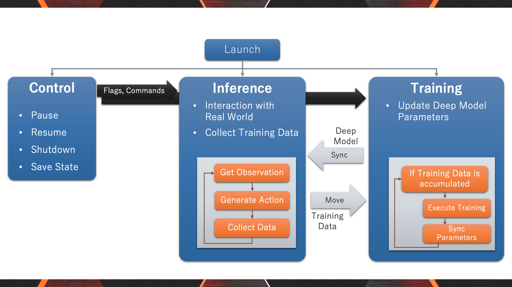

# Welcome to PAMIQ-Core Documentation!

**PAMIQ-Core** is a framework for building AI agents with real-time learning capabilities through parallel training and inference.



## Installation

```bash
# Basic installation
pip install pamiq-core

# With PyTorch support
pip install pamiq-core[torch]
```

## Documentation

*Coming soon...*
