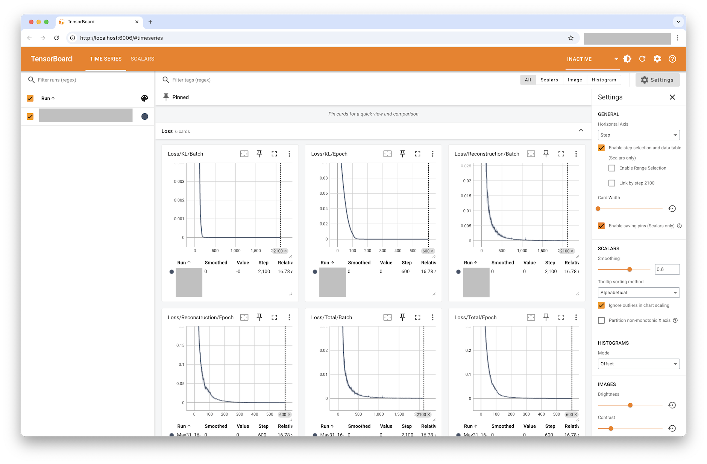

# VAE Torch Sample

This sample demonstrates how to build a **Variational Autoencoder (VAE)** using PyTorch and the `pamiq_core` framework. It showcases the framework's modular approach to machine learning experiments by implementing a complete VAE training pipeline with agent-environment interactions, model management, and data handling.

## What This Sample Teaches

- **Modular ML Architecture**: How to structure ML experiments using `pamiq_core`'s component-based design
- **Agent-Environment Pattern**: How to implement the agent-environment paradigm for VAE training
- **Model Management**: How to wrap PyTorch models for training and inference
- **Data Flow**: How to manage data buffers and streaming in ML pipelines
- **Training Orchestration**: How to coordinate multiple components in a training loop

______________________________________________________________________

## Quick Start

```bash
# Install pamiq-core
pip install pamiq-core

# Install dependencies
cd PATH_TO_YOUR/pamiq-core/samples/vae-torch
pip install .

# Run the VAE training
python main.py
```

The sample will train a VAE on synthetic data (zero tensors) and output training logs. Training automatically uses GPU if available.

### Stopping Training

After sufficient time has passed, you can stop the training using several methods and then view the results with TensorBoard:

**Method 1: Keyboard Interrupt (Simple)**

```bash
# Press Ctrl+C in the terminal where main.py is running
```

**Method 2: Remote Console (Recommended)**

```bash
# In a separate terminal, connect to the running system
pamiq-console --host localhost --port 8391

# Then use the shutdown command
pamiq-console (active) > shutdown
```

### Viewing Results

```bash
# View training metrics and logs
tensorboard --logdir=runs
```

The TensorBoard interface will be available at `http://localhost:6006`.



______________________________________________________________________

## Project Architecture

```
vae-torch/
├── main.py                # 🚀 Entry point and orchestration
├── agent.py               # 🤖 EncodingAgent implementation
├── env.py                 # 🌍 Environment for data provision
├── model.py               # 🧠 VAE neural network architecture
├── trainer.py             # 🏋️ Training logic and loss computation
├── README.md              # 📚 This documentation
├── pyproject.toml         # 📦 Project dependencies
├── uv.lock                # 🔒 Dependency lock file
└── docs/                  # 📁 Documentation assets
    └── images/
        └── resulting_tensorboard.png  # 📊 Sample output screenshot
```

### Component Relationships

```
┌────────────────────────────────────────────────────────────┐
│                        main.py                             │
│                    (Orchestrator)                          │
│  ┌─────────────┐  ┌─────────────┐  ┌─────────────────────┐ │
│  │   Device    │  │   Models    │  │     Data Buffer     │ │
│  │  Detection  │  │Registration │  │   Configuration     │ │
│  └─────────────┘  └─────────────┘  └─────────────────────┘ │
└────────────────────────────────────────────────────────────┘
                              │
                    ┌─────────┼─────────┐
                    │         │         │
          ┌─────────▼──┐  ┌───▼───┐  ┌──▼────────┐
          │   agent.py │  │env.py │  │trainer.py │
          │            │  │       │  │           │
          │🤖 Encoding │  │🌍 Data │  │🏋️ Training│
          │   Agent    │  │Source │  │ Logic     │
          └─────────┬──┘  └───┬───┘  └──┬────────┘
                    │         │         │
                    └─────────┼─────────┘
                              │
                        ┌─────▼──────┐
                        │ model.py   │
                        │            │
                        │🧠 VAE      │
                        │Architecture│
                        │            │
                        │┌─────────┐ │
                        ││Encoder  │ │
                        │└─────────┘ │
                        │┌─────────┐ │
                        ││Decoder  │ │
                        │└─────────┘ │
                        └────────────┘
```

______________________________________________________________________

## How to Read This Project

**Start here for different learning goals:**

### 🎯 **Understanding the Overall Flow**

- **`main.py`** - Entry point that orchestrates all components
    - Shows how to configure device selection
    - Demonstrates component registration and launch

### 🤖 **Agent-Environment Pattern**

- **`agent.py`** - Implements the encoding agent
    - Returns latent representations as "actions"
    - Shows how to access inference models
- **`env.py`** - Provides training data as "observations"
    - Generates synthetic data (zero tensors)
    - Validates agent actions for consistency

### 🧠 **Model Architecture**

- **`model.py`** - VAE implementation (Encoder + Decoder)
    - 3-layer encoder with mean/logvar outputs
    - 3-layer decoder for reconstruction
    - Includes reparameterization trick

### 🏋️ **Training Logic**

- **`trainer.py`** - VAE-specific training procedures
    - Implements VAE loss (reconstruction + KL divergence)
    - Handles optimizer setup and training loops
    - Includes TensorBoard logging

### 📊 **Data Management**

- **Data buffer setup in `main.py`**
    - Shows `RandomReplacementBuffer` usage
    - Demonstrates data flow configuration

### 🔧 **Framework Extension**

- **[pamiq_core docs](../../docs/)** - Framework documentation
- **[API Reference](../../docs/api/)** - Detailed API docs

______________________________________________________________________

## Expected Output

When you run the sample, you'll see:

1. Device detection and model initialization
2. Training progress with loss values
3. TensorBoard logs (if available)
4. Model state saving to `./states/` directory

______________________________________________________________________

## Troubleshooting

### Common Issues

- **CUDA out of memory**: Reduce `batch_size` or `feature_size`
- **Import errors**: Ensure `pamiq_core` is properly installed
- **Slow training**: Check if GPU is being utilized
- **Can't stop training gracefully**: Use `pamiq-console` for clean shutdown instead of `Ctrl+C`

### Stopping Training Safely

- **Recommended**: Use the `shutdown` command in `pamiq-console` for a graceful shutdown that ensures the final state is saved.
- **Quick**: Use `Ctrl+C` for immediate stop (may not save final state properly)
- **Remote**: Use Web API or keyboard shortcuts for external control

### Performance Tips

- Use GPU for faster training
- Increase `batch_size` for better GPU utilization
- Adjust `feature_size` based on your use case

______________________________________________________________________

## Framework Design Philosophy

This sample illustrates several key design principles of `pamiq_core`:

### Separation of Concerns

- **Agent**: Handles decision-making (encoding in this case)
- **Environment**: Manages data provision and validation
- **Models**: Encapsulate neural network logic
- **Trainer**: Implements training algorithms
- **Data**: Manages buffering and data flow

### Modularity

Each component can be easily swapped or modified without affecting others:

- Change the encoder architecture in `model.py`
- Switch to real data by modifying `env.py`
- Experiment with different training strategies in `trainer.py`

### Reusability

Components follow standard interfaces that work across different ML scenarios:

- The same agent pattern works for RL, supervised learning, and generative models
- Training models can be easily reused in different contexts
- Data buffers work consistently across various data types

______________________________________________________________________

## References

- [PyTorch Documentation](https://pytorch.org/)
- [pamiq_core Documentation](../docs/index.md)

______________________________________________________________________

For more information, see the main project [README.md](../../README.md) or the [docs/](../../docs/) directory.
